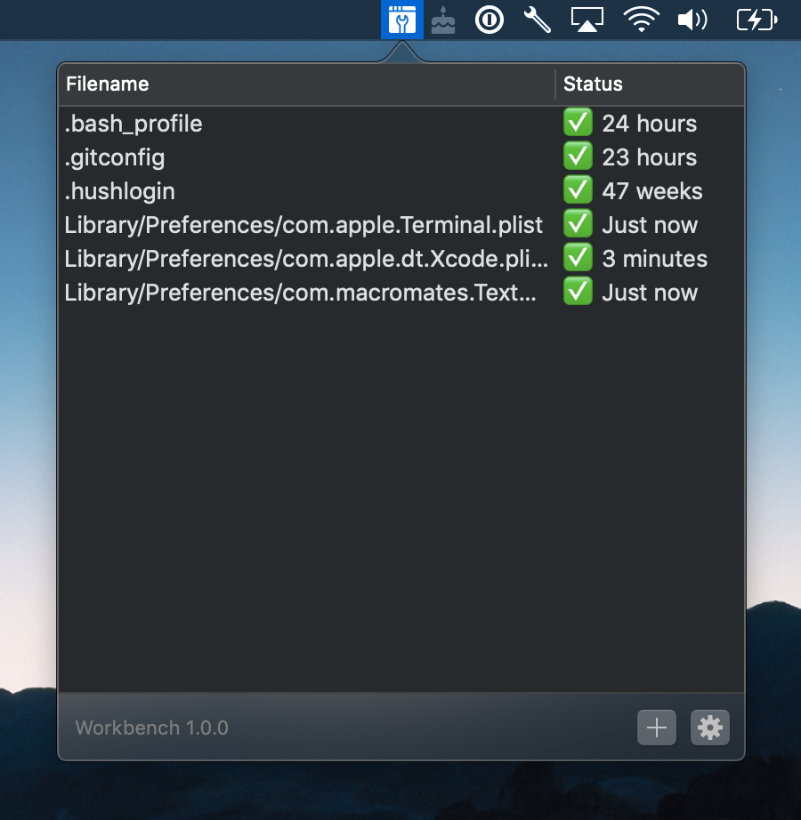

# Workbench 

Seamless, automatic, “dotfile” sync to iCloud.

Workbench is an effective way to keep a backup of your Dotfiles that can be
easily restored when you clean install macOS.

# Support mxcl

Hey there, I’m Max Howell, a prolific producer of open source and probably you
already use some of it (I created [`brew`]). I work full-time on open source and
it’s hard; currently *I earn less than minimum wage*. Please help me continue my
work, I appreciate it 🙏🏻

[Other ways to say thanks](http://mxcl.github.io/#donate).

[`brew`]: https://brew.sh

## Privacy / Security

The binary we provide is signed with our Apple Developer account thus your data
is stored in the database we maintain. **However**, Apple do not give us any
access to your data and according to their documentation the data is encrypted
and private to your iCloud account.

**We assume no liability for your data.**

The app has no analytics and obviously we do not transmit your data anywhere
but iCloud.

Feel free to compile your own copy of Workbench that is signed with your own
Apple account.

## Current caveats

* Only works with one computer.
* Conflict resolution is manual and not assisted (you can choose to upload *what
    is here* or download *what is there*).
* No automatic support for directories.
* Doesn’t remember file permissions.
* We provide no revision control.
* We only support iCloud as the synchronization target.
* Sync’d files can only be from your home directory.
* Maximum file size is 1 MB (this is a CloudKit limitation).

If you want these caveats removed please donate to
[my Patreon](https://www.patreon.com/mxcl); or PR welcome!

# Installation

[Releases](../../releases).

Our binaries automatically update.

## What’s with the name?

I have future plans for this tool which are more general.

## Icon Credit

Icons made by [Freepik] from [www.flaticon.com] licensed under [CC 3.0 BY].

[Freepik]: https://www.freepik.com
[www.flaticon.com]: https://www.flaticon.com
[CC 3.0 BY]: http://creativecommons.org/licenses/by/3.0/
